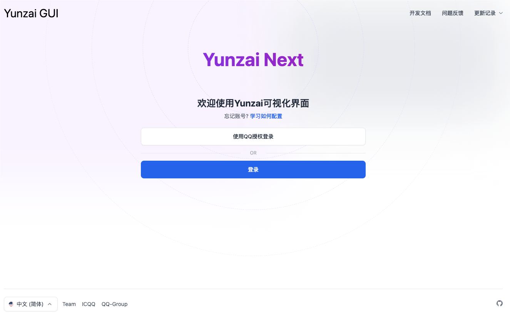

## Yunzai GUI

只需要有Node.js环境即可随时启动的Yunzai可视化管理



## 使用

- 启动

> 可以在任意目录执行，GUI会把当前目录视为机器人根目录

> 若当前目前没有机器人，会进入安装项目步骤

```sh
# 设置镜像（海外环境或已设置可忽略）
npm config set registry https://registry.npmmirror.com
```

```sh
# 默认端口3000
npx yunzai-gui@latest
# 自定义端口
npx yunzai-gui@latest start -p 9370
```

访问 `http://localhost:3000/`

账户 `12345678`

密码 `12345678`

- 修改

`yunzai-gui.json`

> 复制时注意删除注释语句

```json
{
  // 服务器配置
  "server": {
    // 可选，固定后续执行指令
    // 当无参运行时，会检查是否存在该配置
    "exec": "start -p 9370",
    // token 密钥
    "secret_key": "yunzai:secret:key"
  },
  // 管理员用户
  "admins": [
    {
      "username": "12345678",
      "password": "12345678"
    }
  ]
}
```

- 全局

```sh
npm install yunzai-gui@latest -g
# 启动
yunzai-gui
```

```sh
yarn config set registry https://registry.npmmirror.com
yarn global add yunzai-gui
yarn run yunzai-gui
```

## 开发

```sh
git clone --depth=1 https://github.com/yunzai-org/yunzai-gui.git
cd yunzai-gui
```

> 尝试启动

```sh
npm install yarn@1.19.1 -g
yarn
yarn dev
```

> 编译

```sh
yarn build
npm link
```

> 测试

在任意目录中执行

```sh
yunzai-gui
```

- 访问接口

http://localhost:3000/api/env

http://localhost:3000/api/config
